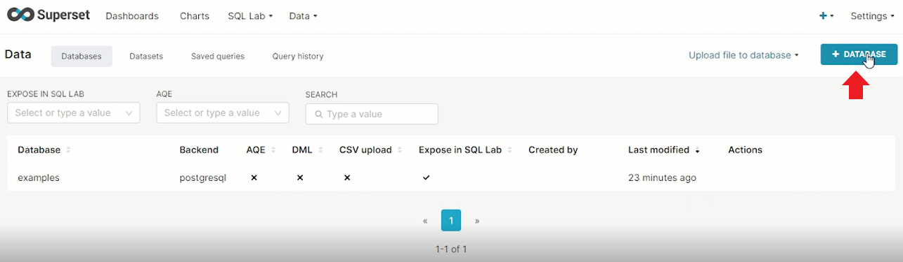
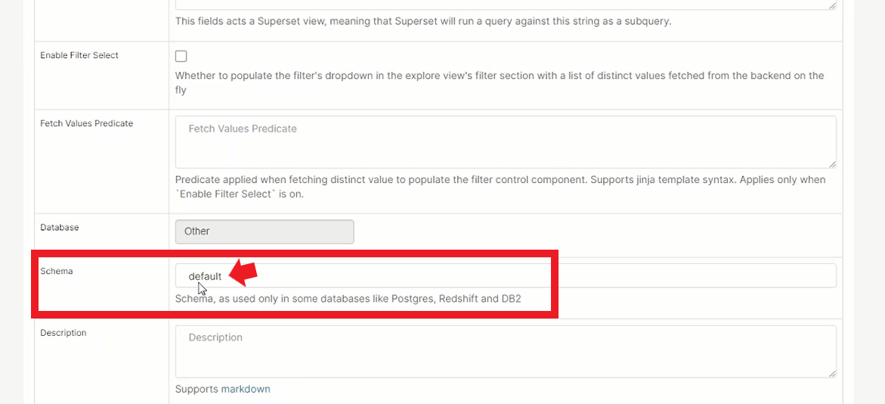

# ABOUT THE PROJECT
SupersetLS - Superset Logstash Solr, is a containerized package of tools to view the realtime logs generated by an application on a dashboard powered by SuperSet. Solr is used to store the log data while Logstash is used to read the changes in a log file and push the new logs to the Solr for persistence. SuperSet is linked to Solr for reading the data and converting the data into charts for visualization.


# DEMO VIDEO TO RUN THE PROJECT

https://user-images.githubusercontent.com/52003038/188606160-26977504-4ed4-4f22-8f6b-75bb47aebcc6.mp4


# STEPS TO SETUP - SupersetLS

* Clone the Git Repository using the git clone command
```
git clone https://github.com/NeoSOFT-Technologies/SupersetLS.git
```


* The repository contains a sample application that generates the logs. This application can be replaced by your application that will generate the logs. \


* The sample app contains a folder named as "logs" inside which all the logs files are dumped by the application \


* Logs being generated by the application \


* Install Docker & Docker-Compose on your machine and the use the "docker-compose-with-solr.yml" file to start the application ater making custom edits (Explained below) \


* Edit "docker-compose-with-solr.yml" file to point it towards the log generating folder. The green box in the image below is the part that you have to change in order to point the relative path to the logs folder. Save the file after making the changes. In the below example, it's pointing to the logs folder of the sample application. \


* Use docker-compose to start the application using "docker-compose-with-solr.yml" file. Wait for all the containers to spin up.
```
docker-compose -f docker-compose-with-solr.yml up
```


* Check if Solr Container is running \
Solr - http://localhost:8983/solr/


* Check if SuperSet Container is running \
SupeSet - http://localhost:8088/


* Create a collection in solr with the name "applicationLogs" \


* Go to SuperSet and cretae a database to link Solr to SuperSet \




* Choose "Other" in SUPPORTED DATABASE dropdown \


* Paste URL below in the SQLALCHEMY URI field
```
solr://solr1-container:8983/solr/applicationLogs
```


* Test the connection if it's successful of not \


* Check if database is added successfully or not \


* Add a dataset using the database \


* Select the options in the image below \


* Click "ADD DATASET AND CREATE CHART" button \


* Check if dataset created successfully \


* Click the dataset and check the URL to get the dataset ID. We will use this ID in the next step \


* Go to the below URL and replace <DATASET_ID> with the dataset ID that you noted in the previous step
```
http://localhost:8088/tablemodelview/edit/<DATASET_ID>
```
Example -
```
http://localhost:8088/tablemodelview/edit/1
```


* Scroll down and find "Schema" which will have the value as "default" \



* Remove "default" from the input box and save the data. \


* Go to Charts tab and create a chart \


* Choose "applicationLogs" from the dropdown and then select the chart type. For this tutorial, We'll choose Big Number Chart. Click "CREATE NEW CHART" button. \


* In the new page, Click "METRICS" and in "SAVED METRICS" choose "COUNT(*)". Click SAVE button. \


* The Chart will be displayed on the right panel. Click Save button. \


* Name the chart & add it to a dashboard. \


* View the dashboard. If the value is 0 and is not changing, that means the logs are not being generated. \


* Start the application that will genearte the logs if not started. \


* Click Force Refresh to refresh the chart \


* Create Charts according to your needs!


